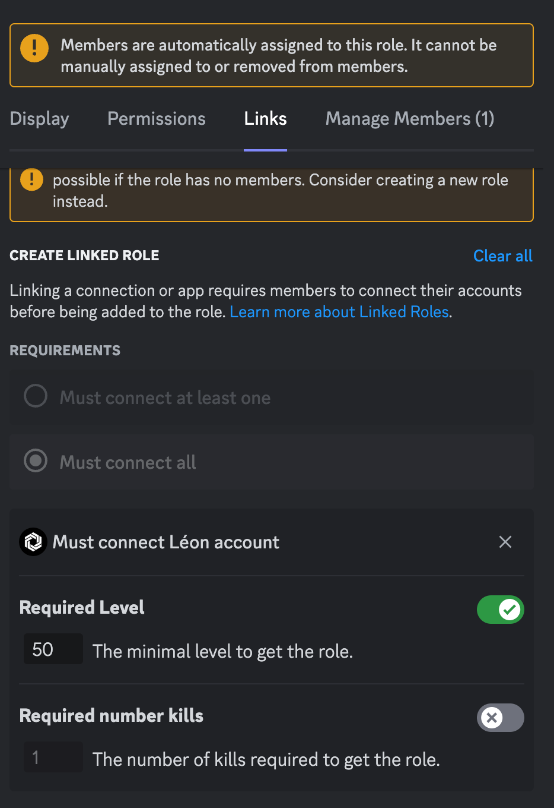
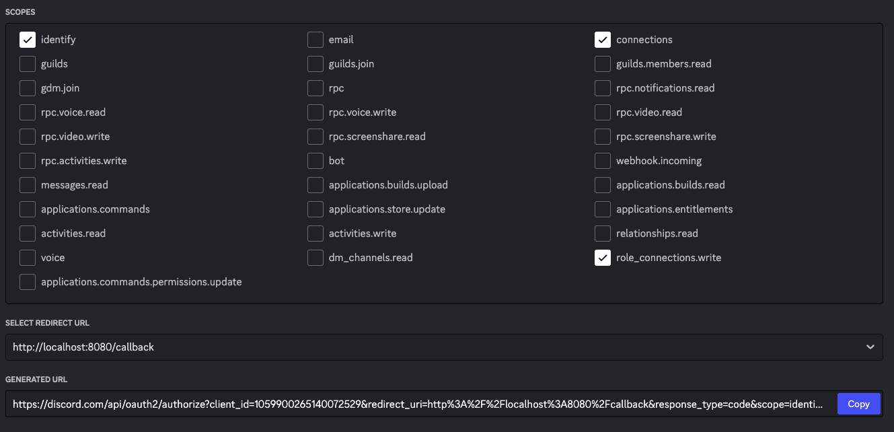

<div align="center">
    <h1>Create a custom linked roles with your parameter</h1>
    <p>Source code of <u>Custom Linked roles</u> workshop made in live on our Discord server</p>
    <p>You can find us on <a href="https://discord.gg/development-community-670988997560107016">Discord</a> and <a href="https://www.youtube.com/channel/UCmH1td7f73IEyYNNg5XDT9g">Youtube</a></p>
</div>

<div align="center">

*This README is available in <a href="/README.md">English</a> and in <a href="/README.FR.md">French</a>.*

</div>

### Summary

The aim is to be able to automate a role with the linked roles feature. Let's take Rainbow Six Siege as an example, where the user must have a certain level and a certain number of kills in order to have the role.

<div align="center">
    
</div>

### Table of contents

- [Summary](#Summary)
- [Prerequisites](#Prerequisites)
- [Configuration](#Configuration)
- [Installation](#Installation)

### Prerequisites

- Node.js (I personally use version v18.16.1)
- NPM

### Configuration

First, you need to configure your Bot so that it can function properly, and retrieve certain information from the [Discord Developer Portal](https://discord.com/developers/applications).

**The information we retrieve must be put in an `.env` file**.

1. Choose the bot where you want to integrate this feature.

2. Information to be retrieved

&emsp;&emsp;2.1. Your Bot token

Go to the **Bot** tab or enter your bot's ID in the following link: `https://discord.com/developers/applications/ID/bot` to go directly to the **Bot** page.

Press **Reset Token** to retrieve your token.

(*Warning: this will reset your token and all applications connected to it will be disconnected!*)

Then add to the `.env` file:
```js
TOKEN=DiscordClientToken
```

&emsp;&emsp;2.2. Client information

You need to go to the **oAuth2** tab and then **General** or put your bot's ID in the following link: `https://discord.com/developers/applications/ID/oauth2/general` to go directly to the **General** page of the **oAuth2** tab.

Then copy your customer's ID and press **Reset Secret** to retrieve the customer's secret.

(*Please note that pressing Client Secret will disconnect all applications using the current Client Secret!*)

Then add to the `.env` file:
```js
SECRET=DiscordClientSecret
ID=DiscordClientID
```

&emsp;&emsp;2.3. The link for users to connect to Discord

Go to the **oAuth2** tab, then **URL Generator**, or enter your bot's ID in the following link: `https://discord.com/developers/applications/ID/oauth2/url-generator` to go directly to the **URL Generator** page in the **oAuth2** tab.

You need to check the following information:
`identify` - Allows you to retrieve user information (name, avatar, banner...)
`connections` - Allows you to retrieve the user's third-party connections (PayPal, Steam...)
`role_connections.write` - Make this feature work!

Then select your redirection URL (see 3.1).
Your link should appear as in the image below:


&emsp;

Then add to the `.env` file:
```js
DISCORD_REDIRECT_URI=DiscordGeneratedURL
```
&emsp;

3. Information to be provided

&emsp;&emsp;3.1. The redirect URL

You can write this information in the **oAuth2** tab and then **General** or you can put your ID in the following link: `https://discord.com/developers/applications/ID/oauth2/general` to go directly to the **General** page of the **oAuth2** tab.

If you wish to use this source code using my redirects, you must write in __Redirects__: `http://localhost:8080/callback`.
Otherwise you need to put the route you want with the port you've chosen in the `src/index.js` file.

#### Example

`src/index.js`
```js
line 18     app.get('/return', async (req, res) => {
```
Here, instead of a `/callback` route, I use a `/return` route.
```js
line 101     app.listen(3030, () => {
line 102         console.log("Listening on port 3030")
line 103     });
```

So here, I'm using port `3030`. So the link I need to put in is: `http://localhost:3030/return`.

Then add it to the `.env` file:

```js
REDIRECT_URI=DiscordRedirectURL
```

### Installation

- Check that you have set up your `.env` correctly. It should contain all this information

```js
TOKEN=DiscordClientToken
SECRET=DiscordClientSecret
ID=DiscordClientID
REDIRECT_URI=DiscordRedirectURL
DISCORD_REDIRECT_URI=DiscordGeneratedURL
```

- Installing dependencies

If you use NPM:
```
npm i
```
If you use Yarn:
```
yarn
```

It will install `r6s-stats-api`, if you don't want to make your Linked role with Rainbow Six Siege, you can remove in package.json the dependency `r6s-stats-api`.

- Launch in development mode

If you use NPM:
```
npm run dev
```
If you use Yarn:
```
yarn run dev
```

- Launch in production mode

If you use NPM:
```
npm run prod
```
If you use Yarn:
```
yarn run prod
```

**In all cases, you must run the `src/register.js` file at least once to be able to send your parameter to DISCORD**.


### Special Thanks

- [booleans-oss](https://github.com/booleans-oss) - CTO at [Development Community](https://github.com/development-community)
- [VIX](https://github.com/xMrVIXx) - Léon's Developer Team at [Development Community](https://github.com/development-community)
